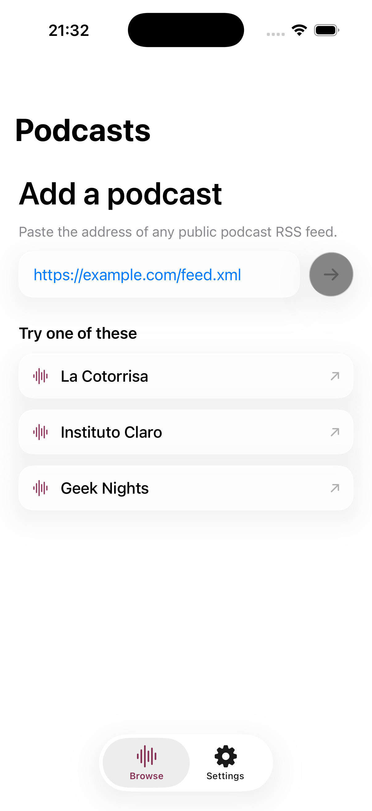
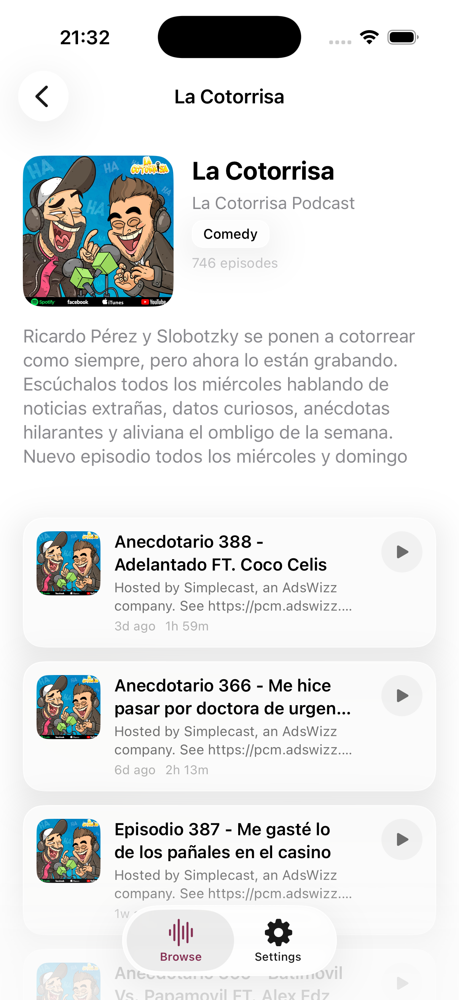
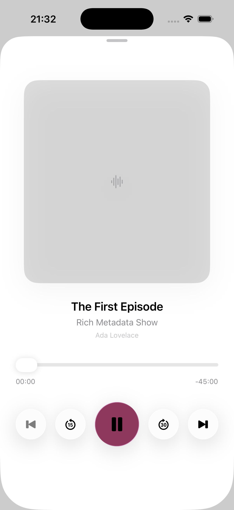
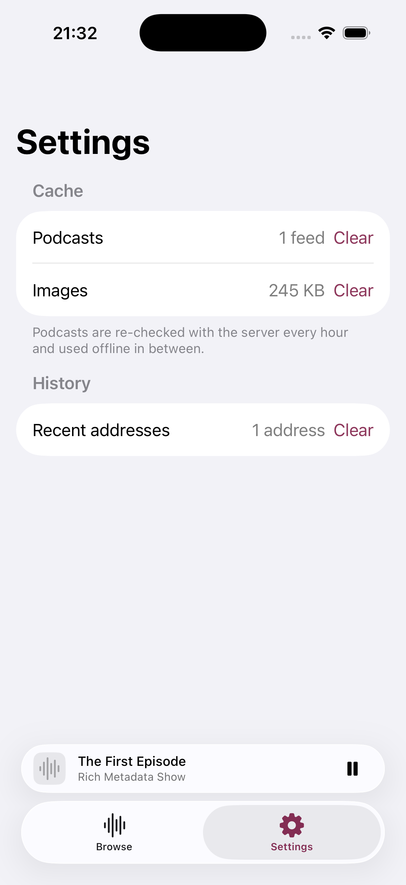

# Podcast Player

A native iOS podcast player built from public RSS feeds. Paste a feed address,
browse the show, and play any episode — with background playback, lock screen
controls, and caching for both feeds and artwork.

Built for the exercise described in `Exercicio - Podcast.pdf`.

| Feed source | Podcast detail | Player | Settings |
|---|---|---|---|
|  |  |  |  |

The detail screenshot is the real La Cotorrisa feed from the brief.

## Requirements

Xcode 26 or later, iOS 26 simulator or device.

**No package manager step.** The app has zero third-party dependencies —
everything is first-party Apple frameworks.

## Build and run

```bash
open PodcastPlayer.xcodeproj      # then ⌘R
```

Or from the command line:

```bash
xcodebuild -scheme PodcastPlayer \
  -destination 'platform=iOS Simulator,name=iPhone 17' build
```

## Tests

```bash
xcodebuild -scheme PodcastPlayer \
  -destination 'platform=iOS Simulator,name=iPhone 17' test
```

191 unit tests (Swift Testing) and 17 UI tests (XCUITest), 208 in total. **The
suite never touches the network** — the three feeds from the brief are checked
in as fixtures alongside synthetic cases for malformed XML, missing fields,
every duration format, and empty channels.

The UI tests include XCTest's automated accessibility audit over every screen,
both at default and at the largest accessibility text size. On an iPad
destination, three further tests exercise the split-view layout (they skip
themselves on compact devices).

Two test classes are excluded from the default suite and run by name:

```bash
# Loads a real public feed over the network and starts playback.
xcodebuild ... -only-testing:PodcastPlayerUITests/LiveFeedSmokeTest test

# Walks the app slowly so screenshots can be captured.
xcodebuild ... -only-testing:PodcastPlayerUITests/ScreenshotTour test
```

## Sample feeds

The three from the brief:

- `https://feeds.megaphone.fm/la-cotorrisa` — La Cotorrisa (Español)
- `https://anchor.fm/s/7a186bc/podcast/rss` — Instituto Claro (Português)
- `http://feeds.feedburner.com/GeekNights` — Geek Nights (English)

Plus three more, which between them cover both `itunes:duration` spellings seen
in the wild and a fourth language:

- `https://jovemnerd.com.br/feed-nerdcast/` — NerdCast (Português, 1,700+ episodes)
- `https://feedpress.me/9to5machappyhour` — 9to5Mac Happy Hour (English)
- `http://feeds.feedburner.com/radio-canada/aujourdhuilhistoire` — Aujourd'hui l'histoire (Français)

All six are offered as one-tap buttons on the first screen.

## Architecture

MVVM over a thin domain layer. Dependencies point inward: `Features` → `Domain`
← `Data`, and **`Domain` imports nothing but `Foundation`.**

```
App/          PodcastPlayerApp, AppEnvironment (composition root), RootView
Features/     FeedSource, PodcastDetail, Player, Settings   (View + ViewModel)
Domain/       Podcast, Episode, AppError, ViewState + every boundary protocol
Data/         HTTPClient, RSSFeedParser, PodcastRepository,
              SwiftData stores, ImageCache, AudioPlayerService
Core/         Formatters, StateView, AsyncCachedImage, Glass/
```

Three rules carry most of the weight:

- **ViewModels depend only on `Domain` protocols.** Not on `URLSession`, not on
  SwiftData, not on `AVPlayer`. That is why all 191 unit tests run against
  hand-written fakes with no network, no database, and no audio hardware.
- **`Data` types never escape `Data`.** SwiftData `@Model` classes and raw
  parser output are mapped to domain value types at the repository boundary, so
  the persistence choice stays replaceable.
- **`AppEnvironment` is the only file that names a concrete type.** Everything
  else sees protocols.

Every screen exposes a single `ViewState<T>` (`idle/loading/loaded/empty/failed`)
rendered by one shared `StateView`, so loading spinners, empty states, and
error-with-retry look and behave identically everywhere.

## Caching

Both caches are clearable independently from Settings, because dumping a
hundred megabytes of artwork is a different decision from forgetting which
shows you follow.

**RSS — stale-while-revalidate.** A cached feed renders immediately with no
spinner. A conditional `GET` using the stored `ETag`/`Last-Modified` revalidates
in the background; `304` keeps the cache and just refreshes the timestamp. TTL
is one hour.

**Images — two tiers.** `NSCache` in memory, SHA-256-keyed files on disk with
LRU eviction against a 100 MB cap. Concurrent requests for the same URL are
deduplicated, so a grid of episodes sharing one artwork fires a single download.

The rule that matters most is the failure path: **any network or parse failure
with a cached copy present serves that copy** rather than an error screen. The
user asked for a podcast, we have a podcast, and refusing to show it because a
background refresh failed would be technically correct and practically useless.
That holds for pull-to-refresh too.

## Error handling

One `AppError` crosses every boundary. `URLError` and parse failures are
translated in the data layer, so no transport type reaches a ViewModel. Every
case carries a user-facing message and a recovery suggestion, and `isRetryable`
decides whether a Retry button appears — offering one for a mistyped address
just teaches people to distrust the button.

There is no `try!`, no force-unwrap, and no `fatalError` in application code.

## Assumptions and trade-offs

**iOS 26 deploy target.** Liquid Glass (`.glassEffect`, `GlassEffectContainer`,
`.tabViewBottomAccessory`) is iOS 26+. Supporting iOS 17 would mean wrapping
every glass surface in `#available` with material fallbacks, roughly doubling
the UI code. Every Liquid Glass call is confined to `Core/Glass/GlassStyles.swift`,
so lowering the target means rewriting one file's bodies, not touching any view.

**Arbitrary loads are permitted in ATS.** The brief's own Geek Nights feed is
`http://`, and several podcast media CDNs are still HTTP-only. Blocking them
would fail one of the three required sample feeds.

**The parser is deliberately lenient.** Publishers omit fields constantly, and a
feed missing an author is still perfectly listenable. Every optional field
degrades to `nil`, and an item with no audio enclosure is skipped rather than
allowed to fail a 700-episode feed. Only two things are fatal: XML we cannot
read, and a channel with no playable episodes.

**Reference feeds are truncated to five items each.** Full copies are 1.8 MB;
the checked-in fixtures keep the channel metadata verbatim and the first five
items, which is enough to pin every parsing behaviour.

**Contrast and Dynamic Type are excluded from the automated audit**, with the
reasoning recorded in `AccessibilityAuditTests`. The contrast check flags
Apple's own semantic colours — the Settings screen is a stock SwiftUI `List`
and reports eight issues, none of them ours. The Dynamic Type check cannot see
through the combined accessibility element that makes an episode row read as
one item to VoiceOver. Everything else the audit checks is enforced, and actual
reflow at accessibility sizes is asserted behaviourally instead.

**Playback position is not persisted across launches.** The brief does not ask
for it, and it would need a per-episode progress store plus resume semantics.
Deliberately out of scope.

**Feed order is the queue order.** Playing any episode queues the entire list so
next and previous are meaningful, rather than queueing one episode alone.

## Accessibility and layout

Adaptive by size class: `NavigationSplitView` at regular width so opening a
podcast on iPad does not push the form off screen, `NavigationStack` at compact.
The episode list uses an adaptive grid that becomes multi-column on wide
screens.

At accessibility text sizes the layout gives ground rather than clipping:
episode titles stop truncating and their descriptions step aside, artwork
shrinks, and the detail header caps its blurb so episodes stay reachable.
Icon-only controls all carry VoiceOver labels, episode rows read as one element
rather than five fragments, and the progress slider announces elapsed and
remaining time in words — VoiceOver reads "42:30" as a time of day, not a
length.

## Notes on the exercise

`CLAUDE.md` records the working agreement — architecture rules, testing
standards, and design constraints — settled before any code was written.
`docs/superpowers/plans/` contains the implementation plan the commits follow.

The commit history is intended to read as the build order: domain, then
parsing, then caching, then the repository, then each screen. One logical
change per commit.

One bug is worth calling out, because it says something about the test
strategy rather than the code. `MPMediaItemArtwork`'s request handler is
invoked by MediaPlayer on a background queue; built inside a `@MainActor`
method it carries an isolation assertion that traps with `SIGILL` the moment
the system asks for artwork. Every fixture feed points its artwork at
`example.test`, which never resolves — so artwork was always `nil`, the handler
was never built, and **178 unit tests plus 6 UI tests all passed against a
crash that fired on the very first real feed.** It was caught by adding a
live-network smoke test, and is now pinned by a regression test that requests
the image from a background thread.
